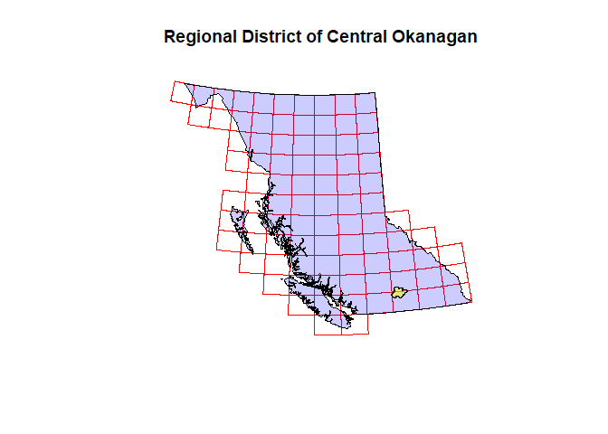
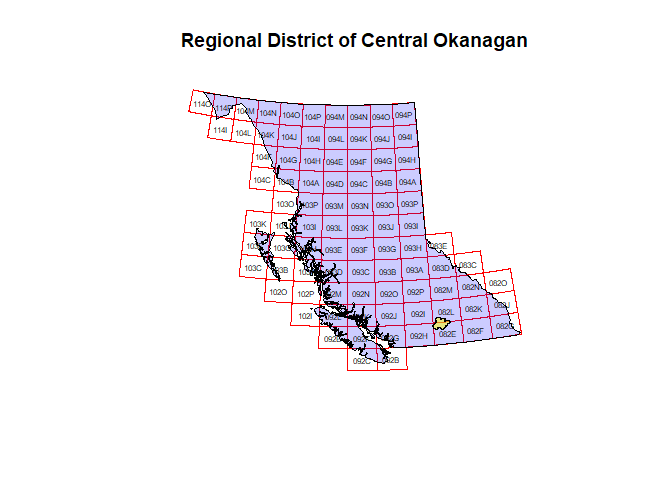
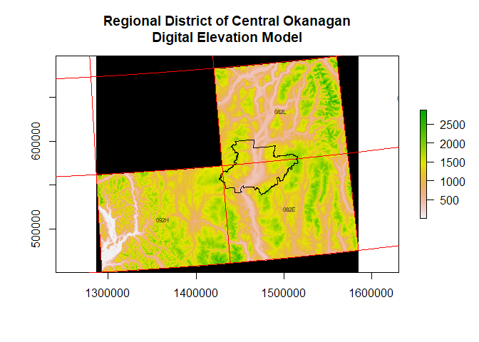
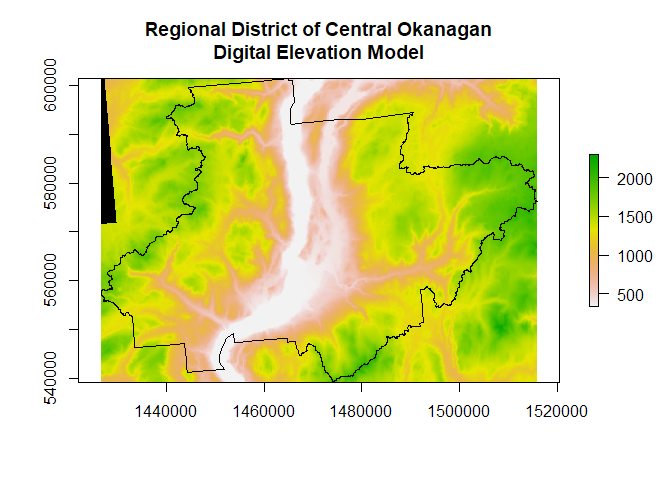
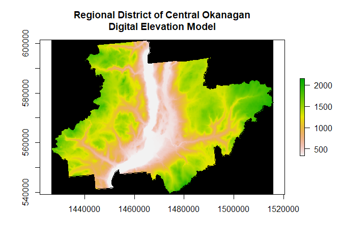

**Development version**: testing R code for fetching/caching/loading mapsheets
Some preamble - I will need to organize this kind of data loading stuff into a function or RData data file for the package


```r
# set the data directory and load helper functions
library(here)
source('utility_functions.R')
```

```
## Loading required package: xml2
```

```
## Loading required package: sp
```

```
## rgdal: version: 1.5-8, (SVN revision 990)
## Geospatial Data Abstraction Library extensions to R successfully loaded
## Loaded GDAL runtime: GDAL 3.0.4, released 2020/01/28
## Path to GDAL shared files: C:/Program Files/R/R-4.0.1/library/sf/gdal
## GDAL binary built with GEOS: TRUE 
## Loaded PROJ runtime: Rel. 6.3.1, February 10th, 2020, [PJ_VERSION: 631]
## Path to PROJ shared files: C:/Program Files/R/R-4.0.1/library/rgdal/proj
## Linking to sp version:1.4-2
## To mute warnings of possible GDAL/OSR exportToProj4() degradation,
## use options("rgdal_show_exportToProj4_warnings"="none") before loading rgdal.
```

```
## Linking to GEOS 3.8.0, GDAL 3.0.4, PROJ 6.3.1
```

```
## 
## Attaching package: 'sf'
```

```
## The following object is masked from 'package:gdalUtils':
## 
##     gdal_rasterize
```

```
## 
## Attaching package: 'fasterize'
```

```
## The following object is masked from 'package:graphics':
## 
##     plot
```

```
## The following object is masked from 'package:base':
## 
##     plot
```

```
## Need help? Try Stackoverflow: https://stackoverflow.com/tags/ggplot2
```

```
## Loading required package: foreach
```

```
## Loading required package: iterators
```

```
## Loading required package: snow
```

```r
# load the NTS/SNRC mapsheets
blocks.sf = loadblocks_bc()
blocks.codes = findblocks_bc()
```

To demonstrate this package we'll need a polygon covering a (relatively) small geographical extent in BC. 
Start by loading the `bcmaps` package and grabbing the polygons for the BC provincial boundary and the 
Central Okanagan Regional District


```r
example.name = 'Regional District of Central Okanagan'
library(bcmaps)
bc.bound.sf = bc_bound()
districts.sf = regional_districts()
example.sf = districts.sf[districts.sf$ADMIN_AREA_NAME==example.name, ]
```

Now have a look at where the selected district lies in the province, with reference to the NTS/SNRC grid.
We use `st_geometry` to drop the feature columns from the `sf` objects and keep only the geometries, which helps to de-clutter
plots whenever we're just interested in the location(s) of something, and not the attributes attached to those locations.


```r
plot(st_geometry(blocks.sf), main=example.name, border='red')
plot(st_geometry(bc.bound.sf), add=TRUE, col=adjustcolor('blue', alpha.f=0.2))
plot(st_geometry(example.sf), add=TRUE, col=adjustcolor('yellow', alpha.f=0.5))
```

<!-- -->

 The `add=TRUE` argument tells `plot` to overlay the new shape(s) onto our initial plot (the NTS/SNRC grid in red), and
the `border` and `col` arguments specify the outline and fill colours, respectively. 

The base function `adjustcolor` is a very handy one-liner for making opaque colours transparent, *eg.* here it makes the NTS/SNRC grid 
lines visible after overlaying the (filled) BC polygon.

Looking closely, `example.sf` (in yellow) overlaps with three different NTS/SNRC mapsheet blocks. To fetch all of the raster data corresponding to
this polygon, we will need to download three files with the appropriate mapsheet codes. These 4-character codes can be added as annotations on this plot
by a simple `text` call, where `st_coordinates(st_centroid(st_geometry(blocks.sf)))` returns a matrix of coordinates. 


```r
plot(st_geometry(blocks.sf), main=example.name, border='red')
plot(st_geometry(bc.bound.sf), add=TRUE, col=adjustcolor('blue', alpha.f=0.2))
plot(st_geometry(example.sf), add=TRUE, col=adjustcolor('yellow', alpha.f=0.5))
text(st_coordinates(st_centroid(st_geometry(blocks.sf))), labels=blocks.codes, cex=0.5)
```

<!-- -->

We see that the required mapsheets are coded as: `O92H`, `O82E`, and `O82L`. The `rasterbc::findblocks_bc` function finds the codes automatically:


```r
example.codes = findblocks_bc(example.sf)
```

```
## Reading layer `snrc_std' from data source `H:\git-MPB\rasterbc\data\borders\snrc_std.shp' using driver `ESRI Shapefile'
## Simple feature collection with 89 features and 3 fields
## geometry type:  POLYGON
## dimension:      XY
## bbox:           xmin: 199960.5 ymin: 331658 xmax: 1874986 ymax: 1745737
## projected CRS:  NAD83 / BC Albers
## Reading layer `snrc_std' from data source `H:\git-MPB\rasterbc\data\borders\snrc_std.shp' using driver `ESRI Shapefile'
## Simple feature collection with 89 features and 3 fields
## geometry type:  POLYGON
## dimension:      XY
## bbox:           xmin: 199960.5 ymin: 331658 xmax: 1874986 ymax: 1745737
## projected CRS:  NAD83 / BC Albers
```

```r
print(example.codes)
```

```
## [1] "092H" "082E" "082L"
```

`metadata_bc()` returns the list that contains the filenames associated with these blocks, *eg.* for the elevation (`dem`) layer we have the 
following three rasters:


```r
cfg = metadata_bc()
collection = 'dem'
varname = 'dem'
example.filenames = cfg[[collection]]$out$fname$tif$block[[varname]][example.codes]
print(example.filenames) 
```

```
##                                               092H                                               082E                                               082L 
## "H:/git-MPB/rasterbc/data/dem/blocks/dem_092H.tif" "H:/git-MPB/rasterbc/data/dem/blocks/dem_082E.tif" "H:/git-MPB/rasterbc/data/dem/blocks/dem_082L.tif"
```

These can be merged together into a larger block that covers the `example.sf` polygon:


```r
# merge the blocks using an external (GDAL) mosaic call, via tempfile
example.tempfile = paste0(tempfile(), '.tif')
gdalUtils::mosaic_rasters(example.filenames, dst_dataset=example.tempfile)
```

```
##                                               092H                                               082E                                               082L 
## "H:/git-MPB/rasterbc/data/dem/blocks/dem_092H.tif" "H:/git-MPB/rasterbc/data/dem/blocks/dem_082E.tif" "H:/git-MPB/rasterbc/data/dem/blocks/dem_082L.tif"
```

```
## NULL
```

```r
# load the output, assign min/max stats and variable name
example.tif = setMinMax(raster::raster(example.tempfile))
names(example.tif) = varname

# plot the result
plot(example.tif, main=paste0(example.name, '\nDigital Elevation Model'), colNA='black')
plot(st_geometry(example.sf), add=TRUE)
plot(st_geometry(blocks.sf), add=TRUE, border='red')
text(st_coordinates(st_centroid(st_geometry(blocks.sf))), labels=blocks.codes, cex=0.5)
```

<!-- -->

From here it is straightforward to crop or clip the layer to the boundary of the polygon:


```r
# create a cropped version, plot the result
example.cropped.tif = raster::crop(example.tif, example.sf)
plot(example.cropped.tif, main=paste0(example.name, '\nDigital Elevation Model'), colNA='black')
plot(st_geometry(example.sf), add=TRUE)
```

<!-- -->

```r
# create a clipped version, plot the result
example.clipped.tif = raster::mask(example.cropped.tif, example.sf)
plot(example.clipped.tif, main=paste0(example.name, '\nDigital Elevation Model'), colNA='black')
plot(st_geometry(example.sf), add=TRUE)
```

<!-- -->

Cropping or clipping to the region of interest is very easy with the `raster` package:

When downloading a layer, you have the option of requesting the full BC extent, or supplying a polygon (sf object) that specifies 
a smaller geographical extent. eg. to get the elevation data for the example district, use this command


```r
# # load the borders info and shapefiles for mapsheets
# cfg.borders = readRDS(here('data', 'borders.rds'))
# blocks.sf = sf::st_read(cfg.borders$out$fname$shp['blocks'])
# blocks.codes = cfg.borders$out$code
# 
# # create the source data directory, metadata list and its path on disk
# collection = 'fids'
# 
#
# 
```


