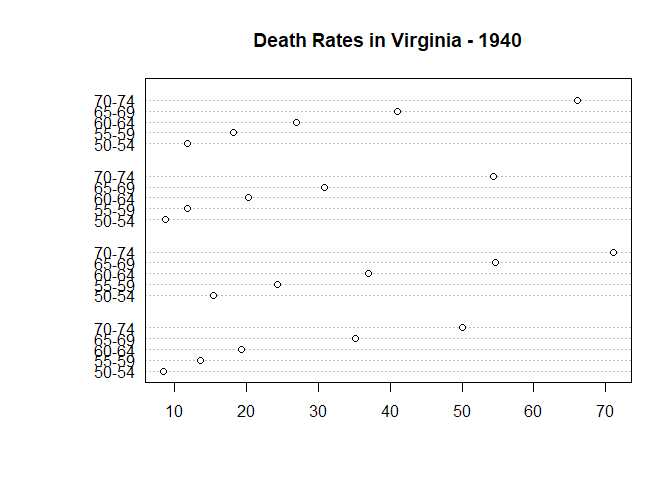

BC borders
================
Dean Koch
June 10, 2020

This is the initial setup script for reproducing the rasterbc dataset.
It downloads some shapefiles to define boundaries, and sets up
configuration details for GIS processing.

Note that the spatial reference system used here
(<a href="https://spatialreference.org/ref/epsg/nad83-bc-albers/" target="_blank">NAD83
/ BC Albers</a>) is shared by both the
<a href="https://cran.r-project.org/web/packages/bcmaps/index.html" target="_blank">bcmaps</a>
package and the
(<a href="http://hectaresBC.org" target="_blank">hectaresBC</a>)
website, so users can combine data from all three sources without
fooling around with projection and alignment.

``` r
# some more comment testing

# here is a regular code comment, that will remain as such
summary(VADeaths)
```

    ##    Rural Male     Rural Female     Urban Male     Urban Female  
    ##  Min.   :11.70   Min.   : 8.70   Min.   :15.40   Min.   : 8.40  
    ##  1st Qu.:18.10   1st Qu.:11.70   1st Qu.:24.30   1st Qu.:13.60  
    ##  Median :26.90   Median :20.30   Median :37.00   Median :19.30  
    ##  Mean   :32.74   Mean   :25.18   Mean   :40.48   Mean   :25.28  
    ##  3rd Qu.:41.00   3rd Qu.:30.90   3rd Qu.:54.60   3rd Qu.:35.10  
    ##  Max.   :66.00   Max.   :54.30   Max.   :71.10   Max.   :50.00

Here’s some more prose. I can use usual markdown syntax to make things
**bold** or *italics*. Let’s use an example from the `dotchart()` help
to make a Cleveland dot plot from the `VADeaths` data. I even bother to
name this chunk, so the resulting PNG has a decent name.

``` r
dotchart(VADeaths, main = "Death Rates in Virginia - 1940")
```

<!-- -->
